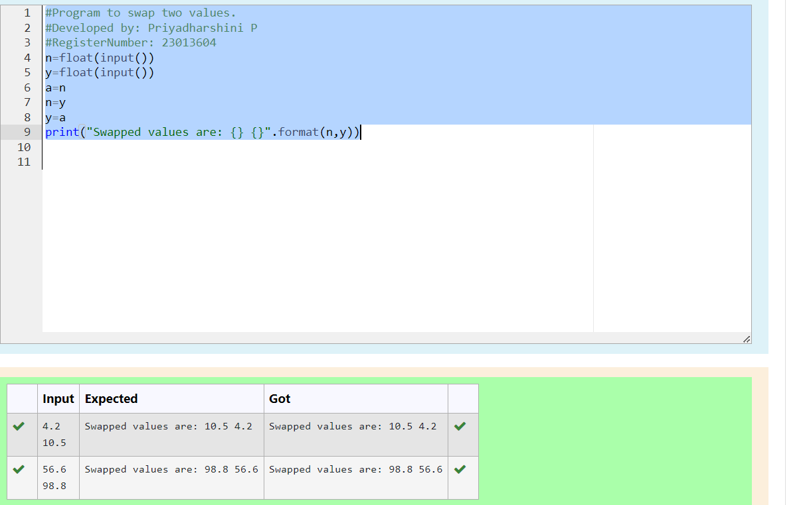

# Swapping-two-values
## AIM:
To write a python program for swapping of two values
## EQUIPEMENT'S REQUIRED: 
PC
Anaconda - Python 3.7
## ALGORITHM: 
### Step 1:
Get the two values from the user
### Step 2: 
Assign the value of second variable to a temporary variable 
### Step 3: 
Assign the value of the first variable to the second variable.
### Step 4:  
Assign the value in temporary variable to the first variable
### Step 5: 
Print both the values it would be interchanged
### Step 6: 
End the program
## PROGRAM:
```
<<<<<<< HEAD
#Program to swap two values.
#Developed by: Priyadharshini P 
#RegisterNumber: 23013604
=======
# Program to swap two values.
# Developed by: Priyadharshini P 
# RegisterNumber: 23013604
>>>>>>> 91b91329bfe202a5c82c6b1dc7c3845fe834f3b3
n=float(input())
y=float(input())
a=n
n=y
y=a
print("Swapped values are: {} {}".format(n,y))
```
<<<<<<< HEAD
## OUTPUT:


=======

## OUTPUT

>>>>>>> 91b91329bfe202a5c82c6b1dc7c3845fe834f3b3

## RESULT:
Thus the swapping of two values are successfully executed


